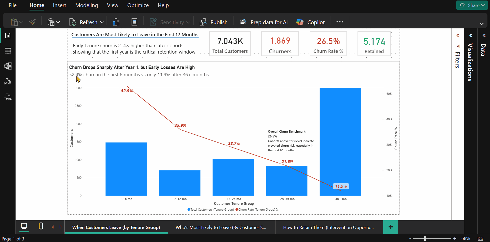
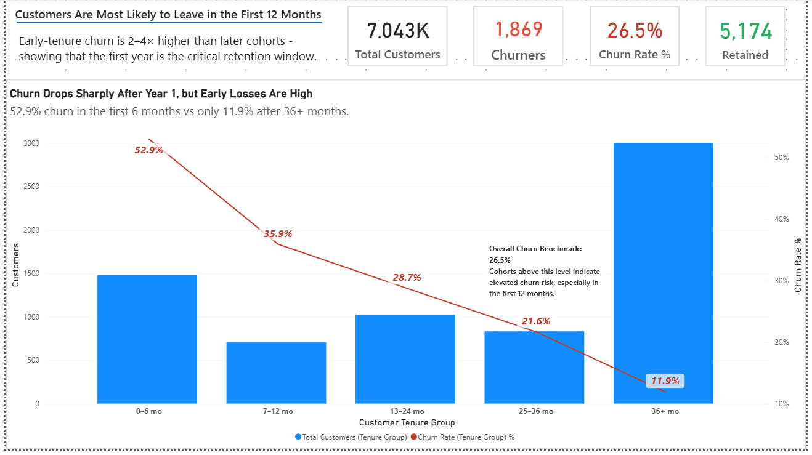
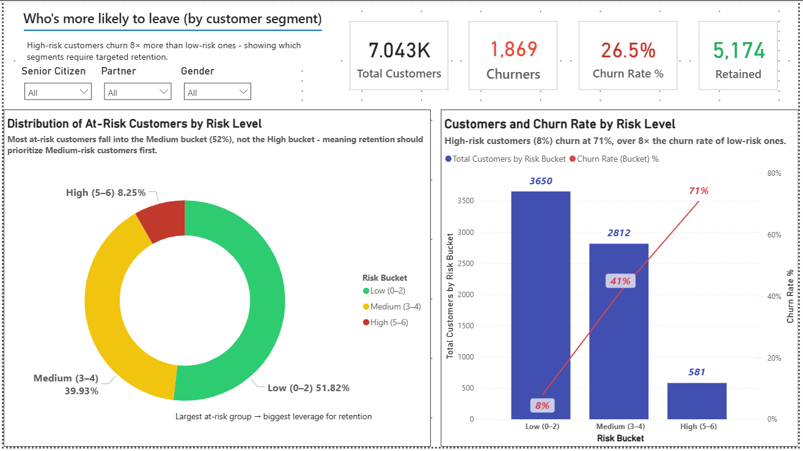
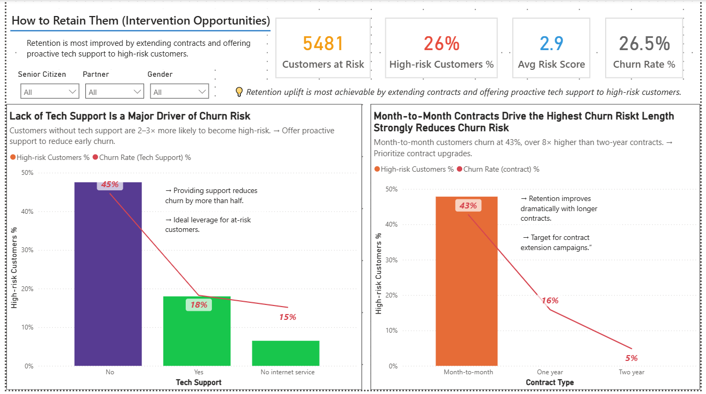

# 📊 Customer Retention SQL Project  

**Full Analytics Workflow: SQL → Metabase → Power BI**

---

## 🎯 Objective  

Analyze customer churn and retention drivers for a telecommunications company using a full modern analytics stack: **PostgreSQL**, **Metabase**, and **Power BI**; moving from raw data to executive insights.

---

## 📁 Project Structure  

```

Retention-sql/

│

├── bi/                → Power BI reports, dashboards, and DAX measures  

├── data/              → Cleaned CSVs or intermediate datasets  

├── docs/              → Documentation and visual materials  

│   ├── visuals/       → Screenshots and demo captures  

│   └── README.md      → (This file)  

├── exports/           → SQL exports, CSV outputs from queries  

├── sql/               → SQL scripts and view definitions  

│

└── README.md          → Root-level overview (optional summary)

```

---

## ⚙️ Workflow Overview

**1️⃣ Data Modeling — PostgreSQL**  
Created analytical SQL views (`v_customers_features`, `v_churn_summary`, etc.) to aggregate, clean, and structure the dataset for analysis.

**2️⃣ Exploration — Metabase**  
Performed interactive exploration with SQL-based visualizations and global filters (`gender`, `partner`, `senior_citizen`).  
Used these visual dashboards to validate churn hypotheses before final modeling.

**3️⃣ Visualization — Power BI**  
Built an executive-level dashboard featuring KPIs, slicers, combo charts, and a star-schema data model to present actionable retention insights.

---

## 🧠 Key Findings  

**1️⃣ Early-tenure churn dominates:**  

Over **50 % of churn occurs within the first six months** — customer onboarding is the critical retention window.  

**2️⃣ Contract type is the main driver:**  

Month-to-month customers churn **4× more** than two-year contract customers.  

**3️⃣ Tech support matters:**  

Lack of tech support doubles churn risk (**45 %** vs **18 %**).  

**4️⃣ Senior and partner filters enable better segmentation,**  

even if their standalone impact is moderate.

---

## 📈 Power BI Dashboard Overview  

### 1️⃣ Customer Retention Overview  



- <u>KPIs</u>: Total Customers, Churners, Churn Rate %, Retained  

- <u>Combo chart</u>: Churn % vs Customer volume by tenure bucket  

&nbsp; → *Insight:* Early churn is the main challenge  

### 2️⃣ Customer Risk Overview  



- <u>Donut chart</u>: Risk bucket distribution  

- <u>Combo chart</u>: Churn % vs Risk level  

&nbsp; → *Insight:* High-risk customers churn ≈ 71 %, 8× higher than low risk  

### 3️⃣ Risk Drivers & Interventions  



- <u>Slicers</u>: **Senior Citizen**, **Partner**, **Gender**  

- <u>Charts</u>:  

&nbsp; - Tech Support vs Churn %  

&nbsp; - Contract Type vs Churn %  

&nbsp; → *Insight:* Month-to-month + no tech support = highest churn likelihood  

---

## 🧮 Power BI Measures

Below are the main DAX measures used to calculate churn and retention KPIs:

---

### 🧍‍♂️Total Customers  
```DAX
Total Customers = COUNTROWS(customers_features)
```

**Description:** Total number of active customers in the dataset.

### 💔 Churners
```DAX
Churners = CALCULATE([Total Customers], customers_features[churn_flag] = TRUE())
```

**Description:** Customers who have churned.

### 📉 Churn Rate %
```DAX
Churn Rate % = DIVIDE([Churners], [Total Customers])
```

**Description:** Percentage of total customers who churned.

### 🔁 Retained
```DAX
Retained = [Total Customers] - [Churners]
```

**Description:** Customers still active (non-churned).

### ⚠️ High-Risk %
```DAX
High-Risk % =
DIVIDE(
    CALCULATE(
        [Total Customers],
        customers_features[risk_bucket] = "High (5-6)"
    ),
    [Total Customers]
)
```

**Description:** Share of customers in the high-risk group.

---

## 🧱 Data Model (Star Schema)  

```

DimSenior      → customers_features ← DimPartner

&nbsp;                                ↑

&nbsp;                             (Fact Table)

```

- **DimSenior / DimPartner:** Created with `DATATABLE()` for clean Yes/No filtering  

- **customers_features:** Fact table with churn flag, service, and demographic data  

- Relationships: **Many-to-One**, **Single Direction**, no ambiguity  

---

## 💡 Technical Notes 

- Converted 0/1 columns to **Boolean** in Power Query (`TRUE/FALSE`)  

- Built dimension tables for `DimSenior` and `DimPartner`  

- Fixed relationship ambiguity by enforcing **single active filter paths**  

- Validated all visuals across Metabase and Power BI for consistency  

---

## 🧩 Metabase Highlights  

- Connected to PostgreSQL schema `retention`  

- Built **exploratory SQL questions**:

&nbsp; - `Churn by Contract Type`

&nbsp; - `Churn by Tech Support`

&nbsp; - `Churn Rate by Tenure Bucket`  

- Implemented **global filters** (gender, senior citizen, partner) using **Field Filter** type  

- Linked variables across all visual cards  

---

## 🧰 Tools & Technologies

**Database:** PostgreSQL  
**BI Tools:** Power BI, Metabase  
**Languages:** SQL, DAX  
**Modeling:** Star Schema (Dim–Fact)  
**Data Types:** Boolean, Categorical, Numeric

---

## 📸 Docs & Visuals

Located in: `/docs/visuals/`

- **🧭 Customer_Retention_Overview.png** — Power BI *Customer Retention Overview*
- **📊 Customer_Risk_Overview.png** — Risk segmentation dashboard
- **⚙️ Risk_Drivers_&_Interventions.png** — Risk driver visuals
- **🎞️ walkthrough.gif** — short dashboard walkthrough animation

---

## 🚀 Recommendations  

1. **Strengthen early engagement** (first 6 months).  

2. **Encourage long-term contracts** for better retention.  

3. **Prioritize tech support** for high-risk and new customers.  

---

## 💬 Summary  

This project demonstrates a complete **data-to-insight pipeline**:  

> SQL data modeling → Metabase exploration → Power BI storytelling  

It integrates technical execution with strategic interpretation — turning raw churn data into **actionable retention recommendations**.

---

💼 **Stack:** PostgreSQL | Metabase | Power BI | DAX | SQL  

🕓 **Completed:** October 2025  

📂 **Repository:** `Retention-sql`

👤Author

**Francesco Marchì**  
📍 Ho Chi Minh City, Vietnam  
📧 [marchi.frncsc@gmail.com]  
🔗 [LinkedIn Profile](https://www.linkedin.com/in/francesco-march%C3%AC-115657205/)