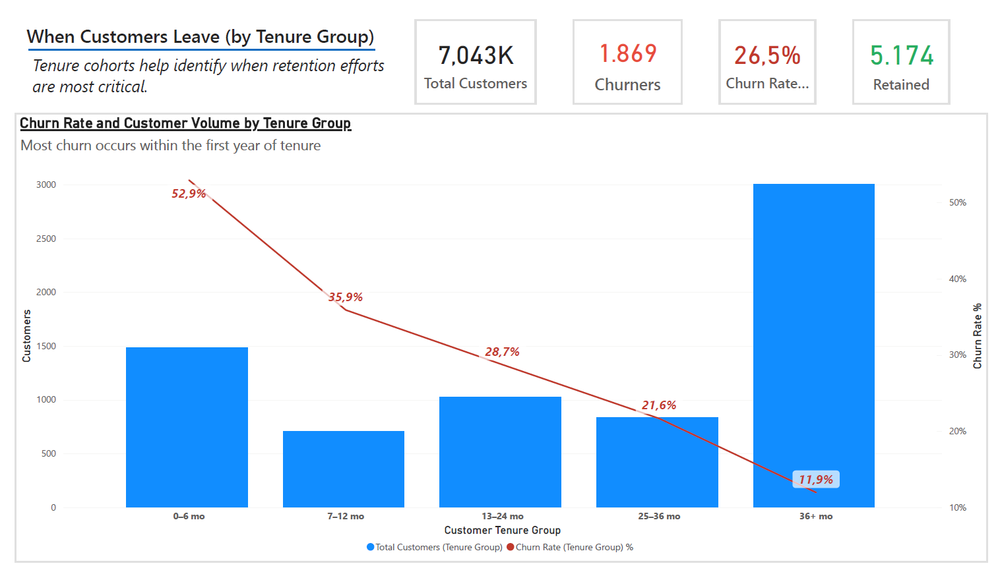
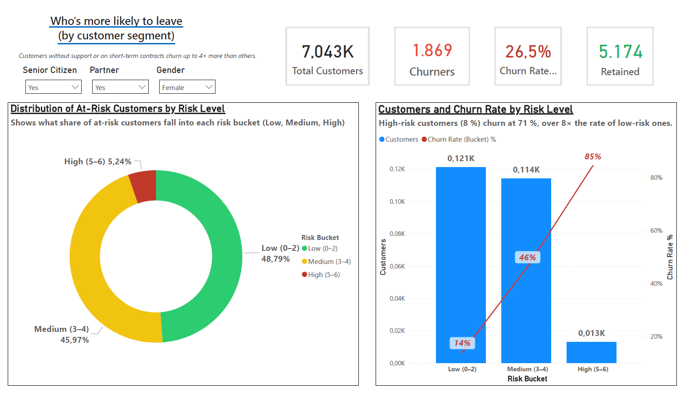
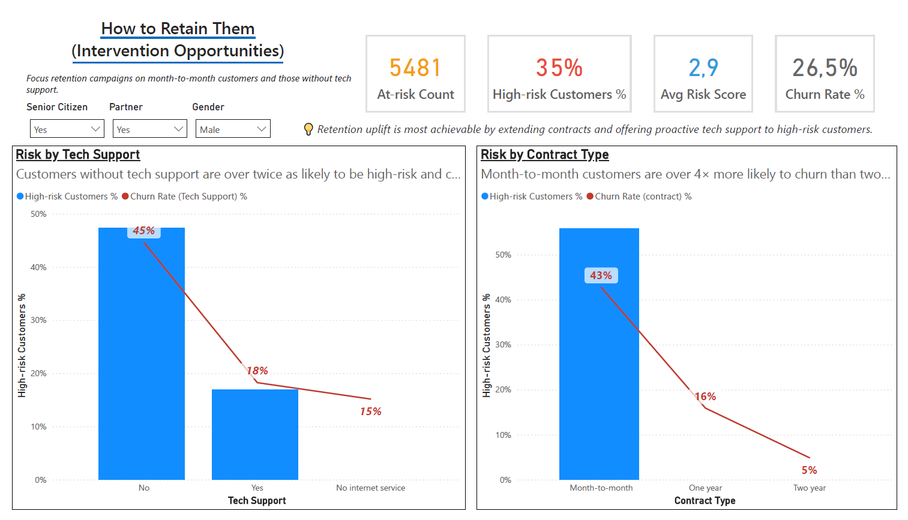

# 📊 Customer Retention SQL Project  
> **Why most customers churn early — and how contract and support interventions reduce churn dramatically.**

Full analytics pipeline: **PostgreSQL → Metabase → Power BI**

---

# 🧭 Executive Summary  

This project uncovers the key drivers behind customer churn in a telecommunications company using a full modern BI workflow.

Through **SQL modeling**, **Metabase exploration**, and an **insight-driven Power BI dashboard**, the analysis reveals:

- Early-tenure churn as the **main retention challenge**  
- Contract type and tech support as the **strongest churn drivers**  
- High-risk customers (8%) as the **core priority** for targeted retention  
- Medium-risk customers as the **largest at-risk segment**, offering maximum ROI  

The result is an actionable churn-reduction strategy based on real data.

---

# 🧩 Business Questions

This analysis answers three core business questions:

1. **When do customers typically churn?**  
   (Tenure analysis — identifying the critical churn window)

2. **Which customers are most at risk of leaving?**  
   (Segmentation — risk scoring, demographics, contract type, tech support)

3. **How can we reduce churn effectively?**  
   (Intervention strategy — contract renewal, tech support, targeting high- and medium-risk groups)

These questions structure the entire dashboard and guide the retention strategy.

---

# 🎯 Project Objective  

Turn raw telecom data into **clear, executive retention insights** by:

- Structuring the data with analytical SQL views  
- Exploring churn patterns and validating hypotheses in Metabase  
- Building a clean, strategic, multi-page Power BI dashboard  
- Applying proper data modeling (star schema) and robust DAX measures  

---

# 📁 Repository Structure  

    Retention-sql/
    │
    ├── bi/                → Power BI files & DAX measures
    ├── data/              → Cleaned datasets / exported SQL views
    ├── docs/              → Documentation & visuals
    │   ├── visuals/       → Screenshots & GIF walkthrough
    │   └── README.md      → (This file)
    ├── exports/           → Query outputs
    ├── sql/               → SQL scripts & view definitions
    └── README.md          → Optional root-level summary

---

# ⚙️ Workflow Overview  

## 1️⃣ SQL Data Modeling (PostgreSQL)  

Created analytical views including:

- `v_customers_features`  
- `v_churn_summary`  
- `v_tenure_groups`  
- `v_risk_scores`  

These transformed raw data into a structured, analysis-ready layer.

---

## 2️⃣ Exploratory Analysis (Metabase)  

Used SQL-native cards and interactive visualizations to analyze churn by:

- Contract type  
- Tech support  
- Tenure  
- Internet service type  

With dynamic global filters (gender, partner, senior citizen).

This step validated key drivers before dashboard creation.

---

## 3️⃣ Executive Dashboard (Power BI)  

Designed a 3-page dashboard following best practices:

- Insight-driven titles and subtitles  
- Clean KPI bar  
- Dynamic slicers with “All Selected” as the default  
- Risk segmentation and churn rate visuals  
- Intervention recommendations  
- Consistent color palette & visual hierarchy  

Built on a **star schema** with clean dimension tables.

---

# 🧠 Key Findings  

## 1️⃣ Early-tenure churn dominates  

Over **50% of churn occurs in the first six months**, making onboarding the highest-ROI retention opportunity.

## 2️⃣ Contract type is the strongest predictor  

Month-to-month customers churn **around 8× more** than two-year contract holders.

## 3️⃣ Tech support cuts churn risk in half  

- No tech support → around **45%** high-risk  
- With tech support → around **18%** high-risk  

## 4️⃣ High-risk = only 8% of customers but 71% churn rate  

Targeted retention saves more customers with fewer resources.  
Medium-risk customers form the **largest at-risk segment**, making them the most impactful group to focus on.

---

# 📊 Power BI Dashboards  

## 1️⃣ When Customers Leave (Tenure Analysis)  

> **Insight:** Most churn happens in the first 12 months — early engagement and onboarding matter most.

---

## 2️⃣ Who’s More Likely to Leave (Segmentation & Risk)  

> **Insight:** Medium-risk customers are the largest at-risk group, while high-risk customers churn at over 70%.

---

## 3️⃣ How to Retain Them (Intervention Priorities)  

> **Insight:** Extending contracts and providing tech support significantly reduce churn in high-risk groups.

---

## 🔍 Segment-Level View (Dynamic Slicer Example)  

Example of Page 3 recalculated for a specific customer segment  
(**Senior = Yes, Partner = Yes, Gender = Male**) to demonstrate correct dynamic filtering.

> Even when filtering to this segment, the patterns remain consistent: lack of tech support and month-to-month contracts remain the strongest churn drivers — confirming the robustness of the model.

---

# 🧮 Key DAX Measures  

(Indentation is used here so everything stays inside one markdown container.)

**Total Customers**

    Total Customers =
        COUNTROWS ( customers_features )

**Churners**

    Churners =
        CALCULATE (
            [Total Customers],
            customers_features[churn_flag] = TRUE ()
        )

**Churn Rate %**

    Churn Rate % =
        DIVIDE ( [Churners], [Total Customers] )

**Retained Customers**

    Retained =
        [Total Customers] - [Churners]

**High-Risk Customers %**

    High-Risk % =
        DIVIDE (
            CALCULATE (
                [Total Customers],
                customers_features[risk_bucket] = "High (5-6)"
            ),
            [Total Customers]
        )

(If your actual table/column names differ slightly, they can be adjusted to match the model.)

---

# 🧱 Data Model (Star Schema)  

    DimSenior      → customers_features ← DimPartner

- `customers_features` used as the main fact table  
- Dimensions built with `DATATABLE()` for clean Yes/No filtering  
- Boolean cleanup in Power Query (e.g., 0/1 → TRUE/FALSE)  
- Single-direction relationships to avoid ambiguity  

---

# 🧩 Metabase Highlights  

SQL-based questions created to explore:

- Churn by Contract Type  
- Churn by Tech Support  
- Churn by Tenure Group  
- Churn by Internet Service  

> This exploratory phase aligned closely with the final Power BI insights and guided which drivers to surface on the dashboard.

---

# 🧰 Tools & Technologies  

- **Database:** PostgreSQL  
- **Exploration:** Metabase  
- **BI:** Power BI  
- **Languages:** SQL, DAX  
- **Modeling:** Star Schema  
- **Data Types:** Boolean, Categorical, Numeric  

---

# 🚀 Recommendations  

1. **Strengthen onboarding during the first 6 months** with welcome journeys, education, and early check-ins.  
2. **Promote long-term contract renewals** (e.g., discounts for moving from month-to-month to one- or two-year contracts).  
3. **Provide proactive tech support** for high- and medium-risk customers, especially those with recent issues.  
4. **Prioritize the medium-risk segment** (largest at-risk group) for campaigns, since it combines meaningful volume with elevated churn.  

---

# 💬 Summary  

This project demonstrates a complete analytics pipeline:

> **SQL modeling → Metabase exploration → Power BI storytelling**

It highlights not just technical execution, but the ability to turn churn data into **strategic retention insights** that decision-makers can act on.

---

**Author:** Francesco Marchì  
📍 Ho Chi Minh City, Vietnam  
📧 marchi.frncsc@gmail.com  
🔗 LinkedIn: https://www.linkedin.com/in/francesco-march%C3%AC-115657205/
