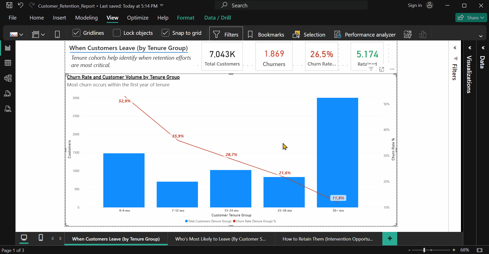

# 📊 Customer Retention SQL Project  

**Full Analytics Workflow: SQL → Metabase → Power BI**

---

## 🎯 Objective  

Analyze customer churn and retention drivers for a telecommunications company using a full modern analytics stack — **PostgreSQL**, **Metabase**, and **Power BI** — moving from raw data to executive insights.

---

## 📁 Project Structure  

```

Retention-sql/

│

├── bi/                → Power BI reports, dashboards, and DAX measures  

├── data/              → Cleaned CSVs or intermediate datasets  

├── docs/              → Documentation and visual materials  

│   ├── visuals/       → Screenshots and demo captures  

│   └── README.md      → (This file)  

├── exports/           → SQL exports, CSV outputs from queries  

├── sql/               → SQL scripts and view definitions  

│

└── README.md          → Root-level overview (optional summary)

```

---

## ⚙️ Workflow Overview  

| Stage | Tool | Description |

|--------|------|-------------|

| 🧩 Data Modeling | **PostgreSQL** | Created analytical SQL views (`v_customers_features`, `v_churn_summary`, etc.) to aggregate and clean data |

| 🔍 Exploration | **Metabase** | Interactive exploration with SQL-based charts and global filters (gender, partner, senior citizen) |

| 📈 Visualization | **Power BI** | Final executive dashboard with KPIs, slicers, combo charts, and star-schema modeling |

---

## 🧠 Key Findings  

**1️⃣ Early-tenure churn dominates:**  

Over **50 % of churn occurs within the first six months** — customer onboarding is the critical retention window.  

**2️⃣ Contract type is the main driver:**  

Month-to-month customers churn **4× more** than two-year contract customers.  

**3️⃣ Tech support matters:**  

Lack of tech support doubles churn risk (**45 %** vs **18 %**).  

**4️⃣ Senior and partner filters enable better segmentation,**  

even if their standalone impact is moderate.

---

## 📈 Power BI Dashboard Overview  

### 1️⃣ Customer Retention Overview  


- KPIs: Total Customers, Churners, Churn Rate %, Retained  

- Combo chart: Churn % vs Customer volume by tenure bucket  

  → *Insight:* Early churn is the main challenge  

### 2️⃣ Customer Risk Overview  


- Donut chart: Risk bucket distribution  

- Combo chart: Churn % vs Risk level  

  → *Insight:* High-risk customers churn ≈ 71 %, 8× higher than low risk  

### 3️⃣ Risk Drivers & Interventions  


- Slicers: **Senior Citizen**, **Partner**, **Gender**  

- Charts:  

  - Tech Support vs Churn %  

  - Contract Type vs Churn %  

  → *Insight:* Month-to-month + no tech support = highest churn likelihood  

---

## 🧮 Power BI Measures  

| KPI | Formula | Description |

|------|----------|-------------|

| **Total Customers** | `COUNTROWS(customers_features)` | Total active customers |

| **Churners** | `CALCULATE([Total Customers], customers_features[churn_flag] = TRUE())` | Customers who churned |

| **Churn Rate %** | `DIVIDE([Churners], [Total Customers])` | Churn share |

| **Retained** | `[Total Customers] - [Churners]` | Active customers |

| **High-Risk %** | `DIVIDE(CALCULATE([Total Customers], customers_features[risk_bucket]="High (5–6)"), [Total Customers])` | High-risk customers share |

---

## 🧱 Data Model (Star Schema)  

```

DimSenior      → customers_features ← DimPartner

                                 ↑

                              (Fact Table)

```

- **DimSenior / DimPartner:** Created with `DATATABLE()` for clean Yes/No filtering  

- **customers_features:** Fact table with churn flag, service, and demographic data  

- Relationships: **Many-to-One**, **Single Direction**, no ambiguity  

---

## 💡 Technical Notes 

- Converted 0/1 columns to **Boolean** in Power Query (`TRUE/FALSE`)  

- Built dimension tables for `DimSenior` and `DimPartner`  

- Fixed relationship ambiguity by enforcing **single active filter paths**  

- Validated all visuals across Metabase and Power BI for consistency  

---

## 🧩 Metabase Highlights  

- Connected to PostgreSQL schema `retention`  

- Built **exploratory SQL questions**:

  - `Churn by Contract Type`

  - `Churn by Tech Support`

  - `Churn Rate by Tenure Bucket`  

- Implemented **global filters** (gender, senior citizen, partner) using **Field Filter** type  

- Linked variables across all visual cards  

---

## 🧰 Tools & Technologies  

| Category | Tools |

|-----------|--------|

| Database | PostgreSQL |

| BI Tools | Power BI, Metabase |

| Languages | SQL, DAX |

| Modeling | Star Schema (Dim–Fact) |

| Data Types | Boolean, Categorical, Numeric |

---

## 📸 Docs & Visuals  

Located in `/docs/visuals/`

| File | Description |

|------|--------------|

| `retention_overview.png` | Power BI Customer Retention Overview |

| `risk_overview.png` | Risk segmentation dashboard |

| `drivers_interventions.png` | Risk driver visuals |

| *(optional)* `demo.mp4` | 20s walkthrough clip for GitHub |

---

## 🚀 Recommendations  

1. **Strengthen early engagement** (first 6 months).  

2. **Encourage long-term contracts** for better retention.  

3. **Prioritize tech support** for high-risk and new customers.  

---

## 💬 Summary  

This project demonstrates a complete **data-to-insight pipeline**:  

> SQL data modeling → Metabase exploration → Power BI storytelling  

It integrates technical execution with strategic interpretation — turning raw churn data into **actionable retention recommendations**.

---

 
💼 **Stack:** PostgreSQL | Metabase | Power BI | DAX | SQL  

🕓 **Completed:** October 2025  

📂 **Repository:** `Retention-sql`

👤Author

**Francesco Marchì**  
📍 Ho Chi Minh City, Vietnam  
📧 [marchi.frncsc@gmail.com]  
🔗 [LinkedIn Profile](https://www.linkedin.com/in/francesco-march%C3%AC-115657205/)